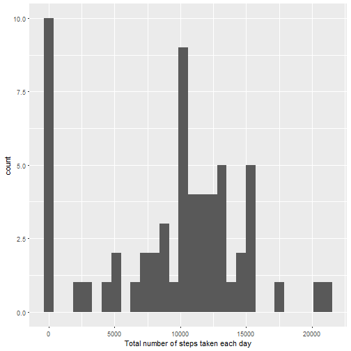
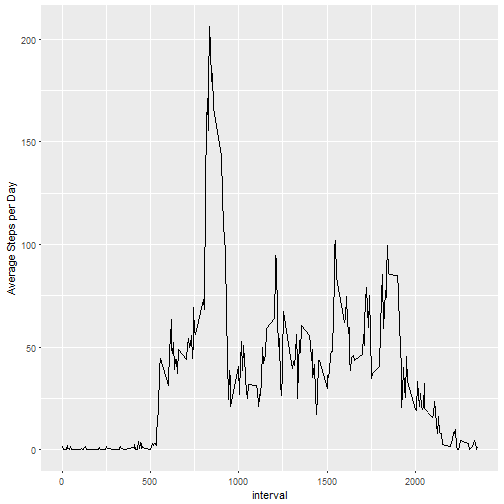
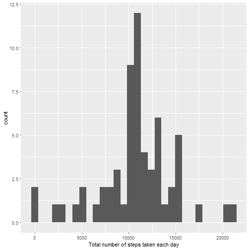
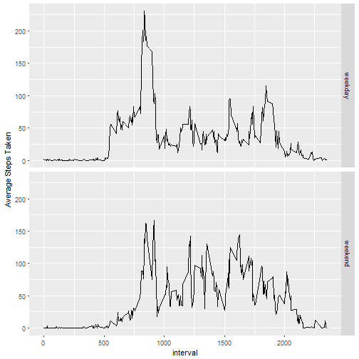

Name: Awal Nazif  
Email address: awalnazif@yahoo.com  
========================================================================  

##Loading the required packages:


```r
require(dplyr)
require(ggplot2)
```

##Loading and preprocessing the data

Loading and viewing the structure of the dataset using read,csv () and str()


```r
data <- read.csv(file = "activity.csv", header = TRUE, na.strings = "NA", stringsAsFactors = FALSE)
str(data)
```

```
## 'data.frame':	17568 obs. of  3 variables:
##  $ steps   : int  NA NA NA NA NA NA NA NA NA NA ...
##  $ date    : chr  "2012-10-01" "2012-10-01" "2012-10-01" "2012-10-01" ...
##  $ interval: int  0 5 10 15 20 25 30 35 40 45 ...
```

Viewing the head (top) and tail (bottom) of the data to ensure the data is loaded properly


```r
head(x = data, n = 10)
```

```
##    steps       date interval
## 1     NA 2012-10-01        0
## 2     NA 2012-10-01        5
## 3     NA 2012-10-01       10
## 4     NA 2012-10-01       15
## 5     NA 2012-10-01       20
## 6     NA 2012-10-01       25
## 7     NA 2012-10-01       30
## 8     NA 2012-10-01       35
## 9     NA 2012-10-01       40
## 10    NA 2012-10-01       45
```

```r
tail(x = data, n = 10)
```

```
##       steps       date interval
## 17559    NA 2012-11-30     2310
## 17560    NA 2012-11-30     2315
## 17561    NA 2012-11-30     2320
## 17562    NA 2012-11-30     2325
## 17563    NA 2012-11-30     2330
## 17564    NA 2012-11-30     2335
## 17565    NA 2012-11-30     2340
## 17566    NA 2012-11-30     2345
## 17567    NA 2012-11-30     2350
## 17568    NA 2012-11-30     2355
```

Transforming the class of the date variable to date class 


```r
data <- mutate(.data = data, date = as.Date(x = date))
with(data = data, expr = class(date))
```

```
## [1] "Date"
```

##The mean total number of steps taken per day

Total number of steps taken per day


```r
group_by(.data = data, date) %>% summarise(Total = sum(steps, na.rm = TRUE))
```

```
## # A tibble: 61 x 2
##    date       Total
##    <date>     <int>
##  1 2012-10-01     0
##  2 2012-10-02   126
##  3 2012-10-03 11352
##  4 2012-10-04 12116
##  5 2012-10-05 13294
##  6 2012-10-06 15420
##  7 2012-10-07 11015
##  8 2012-10-08     0
##  9 2012-10-09 12811
## 10 2012-10-10  9900
## # ... with 51 more rows
```

Histogram of the total number of steps taken each day


```r
group_by(.data = data, date) %>% summarise(steps = sum(steps, na.rm = TRUE)) %>% ggplot() + geom_histogram(mapping = aes(steps)) + xlab("Total number of steps taken each day")
```

```
## `stat_bin()` using `bins = 30`. Pick better value with `binwidth`.
```



Mean and Median of the total number of steps taken per day


```r
group_by(.data = data, date) %>% summarise(Mean = mean(x = steps, na.rm = TRUE), Median = median(x = steps, na.rm = TRUE))
```

```
## # A tibble: 61 x 3
##    date          Mean Median
##    <date>       <dbl>  <dbl>
##  1 2012-10-01 NaN        NA 
##  2 2012-10-02   0.438     0.
##  3 2012-10-03  39.4       0.
##  4 2012-10-04  42.1       0.
##  5 2012-10-05  46.2       0.
##  6 2012-10-06  53.5       0.
##  7 2012-10-07  38.2       0.
##  8 2012-10-08 NaN        NA 
##  9 2012-10-09  44.5       0.
## 10 2012-10-10  34.4       0.
## # ... with 51 more rows
```

##The average daily activity pattern

Time series plot of the 5-minute interval and average number of steps taken  


```r
group_by(.data = data, interval) %>% summarise(Average = mean(x = steps, na.rm = TRUE)) %>% ggplot() + geom_line(mapping = aes(x = interval, y = Average)) + ylab(label = "Average Steps per Day")
```



The 5-minute interval with the maximum number of steps  


```r
group_by(.data = data, interval) %>% summarise(Average = mean(x = steps, na.rm = TRUE)) %>% filter(Average == max(Average))
```

```
## # A tibble: 1 x 2
##   interval Average
##      <int>   <dbl>
## 1      835    206.
```

The 5-minute interval with maximum number of steps is **835**.

##Imputing missing values  

The total number of missing values in the dataset


```r
head(x = filter(.data = data, is.na(steps)), n = 10)
```

```
##    steps       date interval
## 1     NA 2012-10-01        0
## 2     NA 2012-10-01        5
## 3     NA 2012-10-01       10
## 4     NA 2012-10-01       15
## 5     NA 2012-10-01       20
## 6     NA 2012-10-01       25
## 7     NA 2012-10-01       30
## 8     NA 2012-10-01       35
## 9     NA 2012-10-01       40
## 10    NA 2012-10-01       45
```

```r
tail(x = filter(.data = data, is.na(steps)), n = 10)
```

```
##      steps       date interval
## 2295    NA 2012-11-30     2310
## 2296    NA 2012-11-30     2315
## 2297    NA 2012-11-30     2320
## 2298    NA 2012-11-30     2325
## 2299    NA 2012-11-30     2330
## 2300    NA 2012-11-30     2335
## 2301    NA 2012-11-30     2340
## 2302    NA 2012-11-30     2345
## 2303    NA 2012-11-30     2350
## 2304    NA 2012-11-30     2355
```

```r
rows <- nrow(filter(.data = data, is.na(steps)))
```

The total number of missing values in the dataset is **2304**.  

Creating a new dataset from the original dataset filling the missing data with the average of the 5-minutes interval


```r
new_data <- group_by(.data = data, interval) %>% mutate(steps = ifelse(test = is.na(steps), yes = mean(x = steps, na.rm = TRUE), no = steps))
head(x = new_data, n = 10)
```

```
## # A tibble: 10 x 3
## # Groups:   interval [10]
##     steps date       interval
##     <dbl> <date>        <int>
##  1 1.72   2012-10-01        0
##  2 0.340  2012-10-01        5
##  3 0.132  2012-10-01       10
##  4 0.151  2012-10-01       15
##  5 0.0755 2012-10-01       20
##  6 2.09   2012-10-01       25
##  7 0.528  2012-10-01       30
##  8 0.868  2012-10-01       35
##  9 0.     2012-10-01       40
## 10 1.47   2012-10-01       45
```

```r
tail(x = new_data, n = 10)
```

```
## # A tibble: 10 x 3
## # Groups:   interval [10]
##    steps date       interval
##    <dbl> <date>        <int>
##  1 0.    2012-11-30     2310
##  2 0.830 2012-11-30     2315
##  3 0.962 2012-11-30     2320
##  4 1.58  2012-11-30     2325
##  5 2.60  2012-11-30     2330
##  6 4.70  2012-11-30     2335
##  7 3.30  2012-11-30     2340
##  8 0.642 2012-11-30     2345
##  9 0.226 2012-11-30     2350
## 10 1.08  2012-11-30     2355
```

```r
dim(x = new_data)
```

```
## [1] 17568     3
```

Mean and Median of the total number of steps taken per day in the new dataset


```r
group_by(.data = new_data, date) %>% summarise(Mean = mean(x = steps), Median = median(x = steps))
```

```
## # A tibble: 61 x 3
##    date         Mean Median
##    <date>      <dbl>  <dbl>
##  1 2012-10-01 37.4     34.1
##  2 2012-10-02  0.438    0. 
##  3 2012-10-03 39.4      0. 
##  4 2012-10-04 42.1      0. 
##  5 2012-10-05 46.2      0. 
##  6 2012-10-06 53.5      0. 
##  7 2012-10-07 38.2      0. 
##  8 2012-10-08 37.4     34.1
##  9 2012-10-09 44.5      0. 
## 10 2012-10-10 34.4      0. 
## # ... with 51 more rows
```

Histogram of the total number of steps taken each day in the new dataset


```r
group_by(.data = new_data, date) %>% summarise(steps = sum(steps)) %>% ggplot() + geom_histogram(mapping = aes(x = steps)) + xlab("Total number of steps taken each day")
```

```
## `stat_bin()` using `bins = 30`. Pick better value with `binwidth`.
```



##Differences in activity patterns between weekdays and weekends  

Creating a new factor variable in the dataset  


```r
weekday <- c("Monday", "Tuesday", "Wednesday", "Thursday", "Friday")
mutate(.data = new_data, Day = as.factor(x = ifelse(test = weekdays(date) %in% weekday, yes = "weekday", no = "weekend")))
```

```
## # A tibble: 17,568 x 4
## # Groups:   interval [288]
##     steps date       interval Day    
##     <dbl> <date>        <int> <fct>  
##  1 1.72   2012-10-01        0 weekday
##  2 0.340  2012-10-01        5 weekday
##  3 0.132  2012-10-01       10 weekday
##  4 0.151  2012-10-01       15 weekday
##  5 0.0755 2012-10-01       20 weekday
##  6 2.09   2012-10-01       25 weekday
##  7 0.528  2012-10-01       30 weekday
##  8 0.868  2012-10-01       35 weekday
##  9 0.     2012-10-01       40 weekday
## 10 1.47   2012-10-01       45 weekday
## # ... with 17,558 more rows
```

Making a time series panel plot 


```r
mutate(.data = new_data, Day = as.factor(x = ifelse(test = weekdays(date) %in% weekday, yes = "weekday", no = "weekend"))) %>% group_by(interval, Day) %>% summarise(Average = mean(x = steps)) %>% ggplot() + geom_line(mapping = aes(x = interval, y = Average)) + facet_grid(Day ~ .) + ylab(label = "Average Steps Taken")
```


